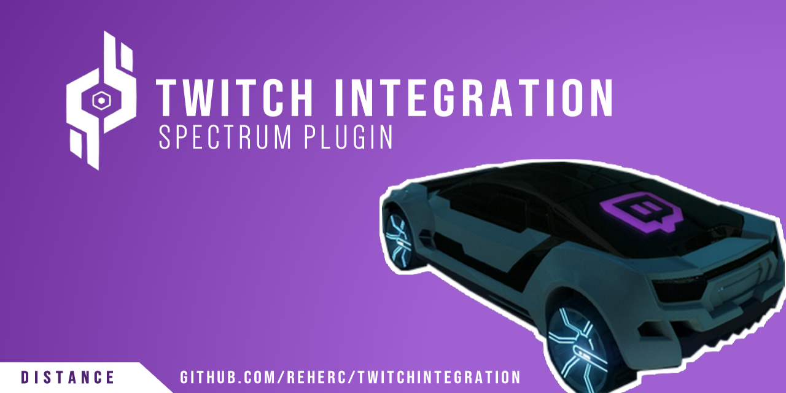

# Twitch Integration
> **A Spectrum plugin that displays twitch chat on the car screen**

> 
> 
> 
> 

# Download the mod
> You can download the mod from the [Releases page](https://github.com/REHERC/TwitchIntegration/releases/latest)

# How to use the mod ?
> - Tutorials are available on the [wiki](https://github.com/REHERC/TwitchIntegration/wiki)